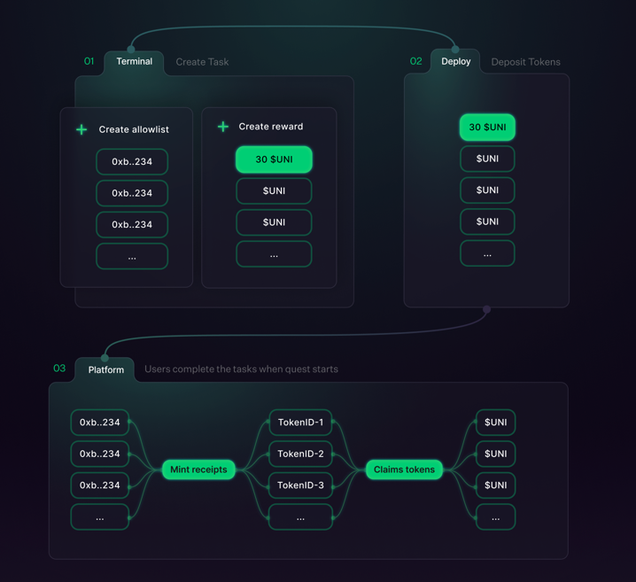

# Quest Protocol

[](https://github.com/rabbitholegg/quest-protocol/actions?query=workflow%3ATests)
[](https://github.com/rabbitholegg/quest-protocol/actions?query=workflow%3ALint)

## Overview

Quests Protocol is a protocol to distribute token rewards for completing on-chain tasks.



---

## Table of Contents

- [Quest Protocol](https://github.com/rabbitholegg/quest-protocol#quest-protocol)
    - [Table of Contents](https://github.com/rabbitholegg/quest-protocol#table-of-contents)
    - [Documentation](https://github.com/rabbitholegg/quest-protocol#documentation)
    - [Layout](https://github.com/rabbitholegg/quest-protocol#layout)
    - [Deployments](https://github.com/rabbitholegg/quest-protocol#deployments)
    - [Install](https://github.com/rabbitholegg/quest-protocol#install)
    - [Testing](https://github.com/rabbitholegg/quest-protocol#testing)
    - [Upgrading](https://github.com/rabbitholegg/quest-protocol#upgrading)
    - [Audits](https://github.com/rabbitholegg/quest-protocol#audits)
    - [Bug Bounty](https://github.com/rabbitholegg/quest-protocol#bug-bounty)
    - [License](https://github.com/rabbitholegg/quest-protocol/#license)

---
## Documentation

For more information on all docs related to the Quest Protocol, see the documentation directory [here](./docs/).

- [Overview](https://github.com/rabbitholegg/quest-protocol/tree/main/docs/overview.md)
- [Quest Claim](https://github.com/rabbitholegg/quest-protocol/tree/main/docs/quest-claim.md)
- [Quest Create](https://github.com/rabbitholegg/quest-protocol/tree/main/docs/quest-create.md)
- [Audit Endpoints](https://github.com/rabbitholegg/quest-protocol/tree/main/docs/audit-endpoints.md)

---

## Layout
Generated with:
```bash
tree --filelimit 20 -I artifacts -I contracts-upgradeable -I factories -I typechain-types -I cache -I img.png
```

```
├── LICENSE
├── README.md
├── audits
├── contracts
│   ├── Erc1155Quest.sol
│   ├── Erc20Quest.sol
│   ├── Quest.sol
│   ├── QuestFactory.sol
│   ├── RabbitHoleReceipt.sol
│   ├── RabbitHoleTickets.sol
│   ├── ReceiptRenderer.sol
│   ├── SampleERC20.sol
│   ├── SampleErc1155.sol
│   ├── TicketRenderer.sol
│   ├── interfaces
│   │   ├── IQuest.sol
│   │   └── IQuestFactory.sol
│   └── test
│       └── TestERC20.sol
├── coverage
│   ├── base.css
│   ├── contracts
│   │   ├── Erc1155Quest.sol.html
│   │   ├── Erc20Quest.sol.html
│   │   ├── Quest.sol.html
│   │   ├── QuestFactory.sol.html
│   │   ├── RabbitHoleReceipt.sol.html
│   │   ├── RabbitHoleTickets.sol.html
│   │   ├── ReceiptRenderer.sol.html
│   │   ├── SampleERC20.sol.html
│   │   ├── SampleErc1155.sol.html
│   │   ├── TicketRenderer.sol.html
│   │   ├── index.html
│   │   ├── interfaces
│   │   │   ├── IQuest.sol.html
│   │   │   ├── IQuestFactory.sol.html
│   │   │   └── index.html
│   │   └── test
│   │       ├── TestERC20.sol.html
│   │       └── index.html
│   ├── coverage-final.json
│   ├── index.html
│   ├── lcov-report
│   │   ├── base.css
│   │   ├── contracts
│   │   │   ├── Erc1155Quest.sol.html
│   │   │   ├── Erc20Quest.sol.html
│   │   │   ├── Quest.sol.html
│   │   │   ├── QuestFactory.sol.html
│   │   │   ├── RabbitHoleReceipt.sol.html
│   │   │   ├── RabbitHoleTickets.sol.html
│   │   │   ├── ReceiptRenderer.sol.html
│   │   │   ├── SampleERC20.sol.html
│   │   │   ├── SampleErc1155.sol.html
│   │   │   ├── TicketRenderer.sol.html
│   │   │   ├── index.html
│   │   │   ├── interfaces
│   │   │   │   ├── IQuest.sol.html
│   │   │   │   ├── IQuestFactory.sol.html
│   │   │   │   └── index.html
│   │   │   └── test
│   │   │       ├── TestERC20.sol.html
│   │   │       └── index.html
│   │   ├── index.html
│   │   ├── prettify.css
│   │   ├── prettify.js
│   │   ├── sort-arrow-sprite.png
│   │   └── sorter.js
│   ├── lcov.info
│   ├── prettify.css
│   ├── prettify.js
│   ├── sort-arrow-sprite.png
│   └── sorter.js
├── coverage.json
├── docs
│   ├── audit-endpoints.md
│   ├── overview.md
│   ├── quest-claim.md
│   └── quest-create.md
├── hardhat.config.ts
├── node_modules  [492 entries exceeds filelimit, not opening dir]
├── package.json
├── scripts
│   ├── deployQuestFactory.js
│   ├── deployRabbitHoleReceipt.js
│   ├── deployRabbitHoleTickets.js
│   ├── upgradeQuestFactory.js
│   ├── upgradeRabbitHoleReceipt.js
│   └── upgradeRabbitHoleTickets.js
├── test
│   ├── Erc1155Quest.spec.ts
│   ├── Erc20Quest.spec.ts
│   ├── Quest.spec.ts
│   ├── QuestFactory.spec.ts
│   ├── RabbitHoleReceipt.spec.ts
│   ├── RabbitHoleTickets.spec.ts
│   ├── SampleErc1155.spec.ts
│   ├── SampleErc20.spec.ts
│   └── types.ts
├── test-gas-stories
├── tsconfig.json
├── waffle.json
└── yarn.lock
```

---

## Deployments

|Chain           |Quest Factory Contract                    |
|----------------|------------------------------------------|
|Ethereum        |0x0                                       |
|Goerli          |0x37A4a767269B5D1651E544Cd2f56BDfeADC37B05|
|Polygon Mainnet |0x0                                       |
|Optimism        |0x0                                       |
|Arbitrum        |0x0                                       |


|Chain           |RabbitHole Receipt Contract               |
|----------------|------------------------------------------|
|Ethereum        |0x0                                       |
|Goerli          |0xa61826ea8F5C08B0c9DC6925A9DEc80204F32292|
|Polygon Mainnet |0x0                                       |
|Optimism        |0x0                                       |
|Arbitrum        |0x0                                       |

|Chain           |RabbitHole Tickets Contract               |
|----------------|------------------------------------------|
|Ethereum        |0x0                                       |
|Goerli          |0xCa0A3439803e1EA9B787258Eafb85A6C665a9b30|
|Polygon Mainnet |0x0                                       |
|Optimism        |0x0                                       |
|Arbitrum        |0x0                                       |

---

## Contracts

The main contracts involved in this phase are:

- `Quest Factory` ([code](https://github.com/rabbitholegg/quest-protocol/tree/main//contracts/QuestFactory.sol))
    - Creates new `Quest` instances of an ERC-1155 reward Quest or ERC-20 reward Quest.
- `RabbitHole Receipt` ([code](https://github.com/rabbitholegg/quest-protocol/tree/main//contracts/RabbitHoleReceipt.sol))
    - An ERC-721 contract that acts as a proof of on-chain activity. Claimed via usage of ECDSA sig/hash
- `ERC-20 Quest` ([code](https://github.com/rabbitholegg/quest-protocol/tree/main//contracts/Erc20Quest.sol))
    - A Quest in which the reward is an ERC-20 token
- `ERC-1155 Quest` ([code](https://github.com/rabbitholegg/quest-protocol/tree/main//contracts/Erc1155Quest.sol))
    - A Quest in which the reward is an ERC-1155 token

---
## Patterns

The contracts use two main patterns.

### Factory Pattern
More reading [here](https://www.tutorialspoint.com/design_pattern/factory_pattern.htm)


### Dependency Injection
More reading [here](https://www.freecodecamp.org/news/a-quick-intro-to-dependency-injection-what-it-is-and-when-to-use-it-7578c84fa88f/)


### Factory Creation Pattern
More reading [here](https://dev.to/jamiescript/design-patterns-in-solidity-1i28#factory)

---

## Install

### Install dependencies

```bash
yarn
```

### Compile Contracts
```bash
yarn compile
```


---

## Testing

### Run all tests:

```bash
yarn test
```

### Run test coverage report:

```bash
yarn test:coverage
```

### Run gas test:

```bash
yarn test:gas-stories
```

---

## Upgrading

The Quest Factory is an upgradable contract. Over time as the space evolves there will be more than just ERC-20 or
ERC-1155 rewards and we want to be non-limiting in our compatibility.

1. `yarn hardhat run --network goerli scripts/upgradeQuestFactory.js` or `scripts/upgradeRabbitHoleReceipt.js` and
   replace the network with `mainnet` if you are upgrading on mainnet.
    1. If you get an error like `NomicLabsHardhatPluginError: Failed to send contract verification request.` It's
       usually because the contract wasn't deployed by the time verification ran. You can run verification again
       with `yarn hardhat verify --network goerli IMPLENTATION_ADDRESS` where the implementation address is in the
       output of the upgrade script.
2. go to https://defender.openzeppelin.com/#/admin and approve the upgrade proposal (the link is also in the output of
   the upgrade script)
3. After the upgrade proposal is approved, create a PR with the updates to the .openzeppelin/[network-name].json file.

---

## Audits

The following auditors reviewed the protocol. You can see reports in `/audits` directory:

- Code4rena TBD (report [here](https://github.com/rabbitholegg/quest-protocol/tree/main/audits/))

---
## Bug Bounty

Once all audits are wrapped up, all contracts except tests, interfaces, dependencies are in scope and eligible for the Quest Protocol Bug Bounty program.

The rubric we use to determine bug bounties is as follows:

| **Level**   | **Example**                                                                                                                                                                                      | **Maximum Bug Bounty** |
| ----------- | ------------------------------------------------------------------------------------------------------------------------------------------------------------------------------------------------ | ---------------------- |
| 6. Severe   | - Draining or freezing of holdings protocol-wide (e.g. draining token distributor, economic attacks, reentrancy, MEV, logic errors)                                                              | Let's talk             |
| 5. Critical | - Contracts with balances can be exploited to steal holdings under specific conditions (e.g. bypass guardrails to transfer precious NFT from parties, user can steal their party's distribution) | Up to 25 ETH           |
| 4. High     | - Contracts temporarily unable to transfer holdings<br>- Users spoof each other                                                                                                                  | Up to 10 ETH           |
| 3. Medium   | - Contract consumes unbounded gas<br>- Griefing, denial of service (i.e. attacker spends as much in gas as damage to the contract)                                                               | Up to 5 ETH            |
| 2. Low      | - Contract fails to behave as expected, but doesn't lose value                                                                                                                                   | Up to 1 ETH            |
| 1. None     | - Best practices                                                                                                                                                                                 |                        |

Any vulnerability or bug discovered must be reported only to the following email: [security@rabbithole.gg](mailto:security@rabbithole.gg).

---
## License
The primary license for the Quest Protocol is the GNU General Public License 3.0 (GPL-3.0), see [LICENSE](./LICENSE).

Several interface/dependencies files from other sources maintain their original license (as indicated in their SPDX header).
All files in test/ remain unlicensed (as indicated in their SPDX header).

