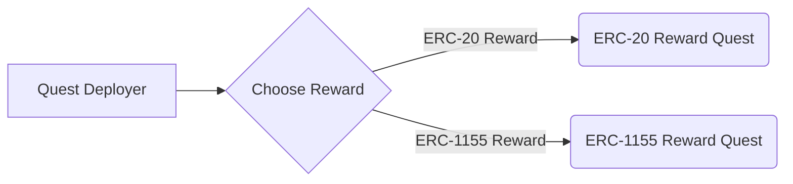

# Quest Protocol

[](https://github.com/rabbitholegg/quest-protocol/actions?query=workflow%3ATests)
[](https://github.com/rabbitholegg/quest-protocol/actions?query=workflow%3ALint)

Once a protocol decides to run a quest, it creates a new `Quest` that will distribute a finite number of `Receipts` that
can
ultimately can be claimed for a `Reward`. `Receipts` are ERC-721 NFTs that are transferrable but only claimable once
per `Quest`.
Individuals that complete the `Quest` action are given the abliity to mint a `Receipt` to their wallet. They then
can use the `Receipt` to claim the `Reward` in the future and any other potential usages.

---

## Table of Contents

- [Quest Protocol](https://github.com/rabbitholegg/quest-protocol#quest-protocol)
    - [Table of Contents](https://github.com/rabbitholegg/quest-protocol#table-of-contents)
    - [Documentation](https://github.com/rabbitholegg/quest-protocol#documentation)
    - [Layout](https://github.com/rabbitholegg/quest-protocol#layout)
    - [Deployments](https://github.com/rabbitholegg/quest-protocol#deployments)
    - [Install](https://github.com/rabbitholegg/quest-protocol#install)
    - [Testing](https://github.com/rabbitholegg/quest-protocol#testing)
    - [Upgrading](https://github.com/rabbitholegg/quest-protocol#upgrading)
    - [Audits](https://github.com/rabbitholegg/quest-protocol#audits)
    - [Bug Bounty](https://github.com/rabbitholegg/quest-protocol#bug-bounty)
    - [License](https://github.com/PartyDAO/party-protocol#license)

---

## Layout

```
docs/ # Start here
├── overview.md
├── quest-creation.md
└── quest-claim.md
test/ # TS tests
```

## Key Concepts

- **Receipts**: An NFT (ERC-721) representing a receipt from completing an action defined in the `Quest`. These are
  originally minted to a participants EOA address and the amount of available Receipts are defined by the `Quest`
  contract. Receipts track ability to see if there is a reward to claim.
- **Rewards**: A set of ERC-20 or ERC-1155 tokens custodied by the `Quest` contract, these are acquired in the Quest
  creation phase from the factory. These are originally transferred to the `Quest` contract on Quest Creation and
  transferred out during the claim Reward process.
- **Quest**: The quest contract itself, which custodies the Rewards, defines the available Receipts, and ultimately
  manages the claim lifecyle
  for receipts and rewards. This can either be an ERC-1155 or ERC-20 reward.
- **Claim Reward**: An (ungoverned) mechanism by which parties can claim `reward` tokens held by the Quest to
  themselves, these are claimable with an unclaimed `Receipt`.
- **Quest Deployer**: Predefined accounts that have autonomous power to creates `Quests`. Conventionally defined as
  Rabbithole, but will open up over time.
- **Proxies**: All `Quest` instances are deployed as simple [`Quest`](../contracts/utils/Proxy.sol) contracts that
  forward calls to a `Quest` implementation contract.
- **ProposalExecutionEngine**: An upgradable contract the `Quest` contract delegatecalls into that implements the logic
  for executing specific proposal types.

---

## Deployments

|Chain           |Quest Factory Contract|
|----------------|----------------------|
|Ethereum        |0x0                   |
|Goerli          |0x0                   |
|Polygon Mainnet |0x0                   |
|Polygon Testnet |0x0                   |
|Optimism        |0x0                   |
|Optimism Testnet|0x0                   |
|Arbitrum        |0x0                   |
|Arbitrum Testnet|0x0                   |

---

## Contracts

The main contracts involved in this phase are:

- `Quest Factory` ([code](../contracts/quests/QuestFactory.sol))
    - Creates new proxified `Quest` instances of an 1155 reward Quest or erc20 reward Quest.
- `ERC20 Quest`
    - The governance contract that also custodies the Receipt NFTs and Rewards. This is also the ERC-721 contract for
      the Governance NFTs.
- `ProposalExecutionEngine`
    - An upgradable logic (and some state) contract for executing each proposal type from the context of the `Party`.
- `TokenDistributor`
    - Escrow contract for distributing deposited ETH and ERC20 tokens to members of parties.

// Put In diagram here

---

## Quest Creation

Quests are created through the `QuestFactory` contract. This is performed
by a whitelisted account, historically the Internal Rabbithole team.

The sequence of events is:

1. Call `QuestFactory.createQuest(rewardType: [erc20|erc1155])` defined as:
   ```solidity
   function createQuest(
      string rewardType,
      address rewardAddress,
   )
   ```
    - `rewardType` will be either an ERC-1155 or an ERC-20 token.
    - `rewardAddress` is the address of the corresponding reward for completing the quest. This can be an ERC-1155 or
      ERC-20 contract address.
2. Transfer rewards to the newly created Quest. You can transfer direct or execute the `depositFullAwardAmount`
   function.
3. The Quest Factory will call the mintAndSend function for the total number of allowed recipients of Receipts.
4. Execute the markQuestAsReady function. This will validate that the Quest is ready for public and upon reaching the
   effective StartDate, will be ready for use.

---

## Testing

### Run all tests:

```bash
yarn test
```

### Run test coverage report:

```bash
yarn test:coverage
```

---

## Audits

The following auditors reviewed the protocol. You can see reports in `/audits` directory:

- Code4rena TBD (report [here](/audits/))

---

## Quest Redemption

Quests are created through the `QuestFactory` contract. This is performed
by a whitelisted account, historically the Internal Rabbithole team.

The sequence of events is:

1. Call `QuestFactory.createQuest(rewardType: [erc20|erc1155])` defined as:
   ```solidity
   function createQuest(
      string rewardType,
      address rewardAddress,
   )
   ```
    - `rewardType` will be either an ERC-1155 or an ERC-20 token.
    - `rewardAddress` is the address of the corresponding reward for completing the quest. This can be an ERC-1155 or
      ERC-20 contract address.
2. Transfer rewards to the newly created Quest. You can transfer direct or execute the `depositFullAwardAmount`
   function.
3. The Quest Factory will call the mintAndSend function for the total number of allowed recipients of Receipts.
4. Execute the markQuestAsReady function. This will validate that the Quest is ready for public and upon reaching the
   effective StartDate, will be ready for use.

---

## UML diagrams

You can render UML diagrams using [Mermaid](https://mermaidjs.github.io/). For example, this will produce a sequence
diagram:



## Upgrading

The Quest Factory is an upgradable contract. Overtime as the space evolves there will be more than just ERC-20 or
ERC-1155 rewards and we want to be non limiting in our compatibility.

1. `yarn hardhat run --network goerli scripts/upgradeQuestFactory.js` or `scripts/upgradeRabbitHoleReceipt.js` and
   replace the network with `mainnet` if you are upgrading on mainnet.
    1. If you get an error like `NomicLabsHardhatPluginError: Failed to send contract verification request.` It's
       usually because the contract wasn't deployed by the time verification ran. You can run verification again
       with `yarn hardhat verify --network goerli IMPLENTATION_ADDRESS` where the implementation address is in the
       output of the upgrade script.
2. go to https://defender.openzeppelin.com/#/admin and approve the upgrade proposal (the link is also in the output of
   the upgrade script)
3. After the upgrade proposal is approved, create a PR with the updates to the .openzeppelin/[network-name].json file.
