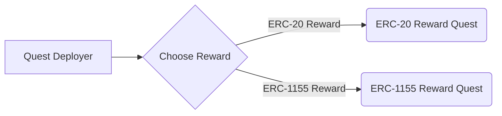

# Quest Merkle Distributor

[](https://github.com/rabbitholegg/quest_merkle_distributor/actions?query=workflow%3ATests)
[](https://github.com/rabbitholegg/quest_merkle_distributor/actions?query=workflow%3ALint)


# Quest V2 Contracts

Once a protocol decides to run a quest, it creates a new `Quest` and distributes a finite number of `Receipts` that can be claimed for a `Reward`. `Receipts` are ERC-721 NFTs that are transferrable but only claimable once per `Quest`. Individuals that complete the `Quest` action are given the abliity to transfer a `Receipt` to their wallet. They then can use the `Receipt` to claim the `Reward` in the future and any other potential usages.

---

## Key Concepts

- **Receipts**: A set of ERC-721 tokens custodied by the `Quest` contract, these are acquired in the Quest creation phase from the factory. These are originally minted to the `Quest` contract and transferred out during claim of `Receipts`.
- **Rewards**: A set of ERC-20 or ERC-1155 tokens custodied by the `Quest` contract, these are acquired in the Quest creation phase from the factory. These are originally minted to the `Quest` contract and transferred out during claim of `Rewards`.
- **Receipt NFT**: An NFT (ERC721) representing a receipt from completing an action defined in the `Quest`.
- **Quest**: The quest contract itself, which custodies the Receipts & Rewards and ultimately manages the claim lifecyle for receipts and rewards. This can either be an 1155Quest or an erc20Quest proxy.
- **Distributions**: An (ungoverned) mechanism by which parties can claim `reward` tokens held by the Quest to themselves, these have a 24hr/block timestamp to acceptance.
- **Quest Deployer**: Predefined accounts that have autonomous power to creates `Quests`. Conventionally defined as Rabbithole, but will open up over time.
- **Proxies**: All `Quest` instances are deployed as simple [`Quest`](../contracts/utils/Proxy.sol) contracts that forward calls to a `Quest` implementation contract.
- **ProposalExecutionEngine**: An upgradable contract the `Quest` contract delegatecalls into that implements the logic for executing specific proposal types.

---

## Contracts

The main contracts involved in this phase are:

- `Quest Factory` ([code](../contracts/quests/QuestFactory.sol))
  - Creates new proxified `Quest` instances of an 1155 reward Quest or erc20 reward Quest.
- `ERC20 Quest` 
  - The governance contract that also custodies the Receipt NFTs and Rewards. This is also the ERC-721 contract for the Governance NFTs.
- `ProposalExecutionEngine` 
  - An upgradable logic (and some state) contract for executing each proposal type from the context of the `Party`.
- `TokenDistributor` 
  - Escrow contract for distributing deposited ETH and ERC20 tokens to members of parties.

// Put In diagram here

---

## Quest Creation

Quests are created through the `QuestFactory` contract. This is performed
by a whitelisted account, historically the Internal Rabbithole team.

The sequence of events is:
1. Call `PartyFactory.createQuest(rewardType: [erc20|erc1155])` defined as:
   ```solidity
   function createQuest(
      string rewardType,
   )
   ```
   - `authority` will be the address that can mint tokens on the created Party. In typical flow, the crowdfund contract will set this to itself.
   - `opts` are (mostly) immutable [configuration parameters](#governance-options) for the Party, defining the Party name, symbol, and customization preset (the Party instance will also be an ERC721) along with governance parameters.
   - `preciousTokens` and `preciousTokenIds` together define the NFTs the Party will custody and enforce extra restrictions on so they are not easily transferred out of the Party. This list cannot be changed after Party creation. Note that this list is never stored on-chain (only the hash is) and will need to be passed into the `execute()` call when executing proposals.
   - This will deploy a new `Proxy` instance with an implementation pointing to the Party contract defined by in the `Globals` contract by the key `GLOBAL_PARTY_IMPL`.
2. Transfer assets to the created Party, which will typically be the precious NFTs.
3. As the `authority`, mint Governance NFTs to members of the party by calling `Party.mint()`.
   - In typical flow, the crowdfund contract will call this when contributors burn their contribution NFTs.
4. Optionally, call `Party.abdicate()`, as the `authority`, to revoke minting privilege once all Governance NFTs have been minted.
5. At any step after the party creation, members with Governance NFTs can perform governance actions, though they may not be able to reach consensus if the total supply of voting power hasn't been minted/distributed yet.

## UML diagrams

You can render UML diagrams using [Mermaid](https://mermaidjs.github.io/). For example, this will produce a sequence diagram:


